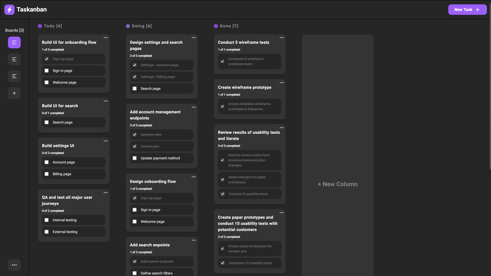

# Task Manager | Next JS

## Getting Started

First, run the development server:

```bash
npm run dev
# or
yarn dev
# or
pnpm dev
```

## Content

- [Overview](#overview)
  - [Screenshot](#screenshot)
  - [Links](#links)
  - [Built with](#built-with)

## Overview

### Screenshot



### Links

- Live Site URL:

### Built with

- Drag and Drop API
- [NextJS](https://nextjs.org/) - React Framework
- [TailwindCSS](https://tailwindcss.com/) - CSS Framework
- [Redux Toolkit](https://redux-toolkit.js.org/) - State Managment Tool
